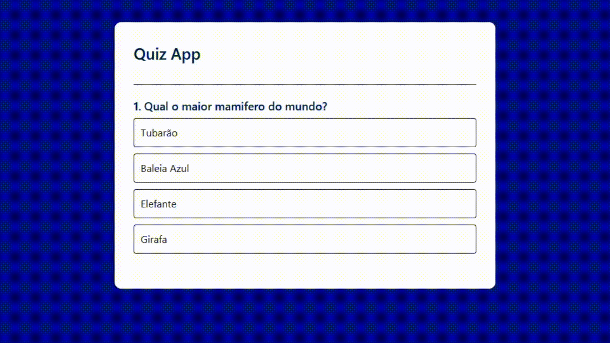

# Projetos Feitos em Javascript
Aqui você encontra alguns projetos desenvolvidos durante meu aprendizado em **JavaScript**.

Eles foram criados com o objetivo de praticar conceitos fundamentais da linguagem, além de aperfeiçoar meus conhecimentos em **HTML5, CSS3 e Tailwind**.

Os projetos incluem desde exercícios clássicos de desenvolvimento web até pequenas aplicações interativas que demonstram manipulação de dados, integração com APIs e criação de interfaces dinâmicas.

<!-- Bagdes informando visualmente as tecnologias utilizadas -->

## 🌟 INTRODUÇÃO
Este repositório reúne alguns dos projetos que desenvolvi durante meus estudos em **JavaScript**. Cada projeto foi criado como forma de praticar conceitos importantes do desenvolvimento web, como manipulação do **DOM**, consumo de **APIs**, criação de interfaces dinâmicas e organização de código.

O foco principal foi utilizar **JavaScript Vanilla**, sem depender de frameworks, para compreender melhor como cada funcionalidade funciona por trás das aplicações modernas.

## 🚀 TECNOLOGIAS

### 👨‍💻 HTML5 e CSS3
A maior parte dos projetos foi desenvolvida utilizando **HTML5 e CSS3** de forma direta, criando a estrutura e a estilização das páginas sem depender exclusivamente de frameworks.

### 💻 Javascript
O **JavaScript** é o coração de todos os projetos.
Todo o código foi desenvolvido utilizando **JavaScript Vanilla**, permitindo entender melhor como funcionam a manipulação de elementos da página, eventos e lógica das aplicações web.

### 🖌 Tailwind
O **Tailwind** CSS foi utilizado em alguns projetos para facilitar a estilização e tornar o desenvolvimento mais rápido e utilizar componentes prontos na internet. Mesmo utilizando o framework, também aplico **CSS3 puro** sempre que necessário para personalizações específicas.

### ⚙ Vite
O **Vite** foi utilizado como ferramenta de building para preparar o ambiente de desenvolvimento, permitindo trabalhar com as tecnologias de forma mais rápida, organizada e eficiente.

## 🎨 Projetos

### 🌨 Weather App

Aplicativo que permite verificar a **temperatura e as condições climáticas de uma cidade pesquisada pelo usuário**.

O projeto realiza uma consulta a uma **API gratuita de clima**, exibindo os dados em uma interface simples e dinâmica.

No JavaScript, a aplicação gera automaticamente a requisição correta para a API, utilizando os dados inseridos pelo usuário. As informações são tratadas e ajustadas antes da consulta, garantindo que a busca seja feita da forma mais eficiente possível.

[acessar projeto](./projects/app-weather/)

### 📝 TO-DO List

Uma **lista de tarefas dinâmica** que permite adicionar novas tarefas, marcar atividades concluídas e limpar a lista.

Todo o dinamismo da aplicação é controlado pelo **JavaScript**, que também define quando e quais estilos devem ser aplicados na interface.

Além disso, as tarefas são armazenadas utilizando o **Local Storage do navegador**, permitindo que os dados permaneçam salvos mesmo após atualizar ou fechar a página.

[acessar projeto](./projects/todo-list/)

### 🧠 Quiz App

Aplicação web interativa que permite ao usuário **responder perguntas de múltipla escolha e receber uma pontuação ao final do quiz**.

O projeto utiliza **JavaScript para controlar toda a lógica do quiz**, incluindo a exibição dinâmica das perguntas, a geração automática dos botões de resposta e o controle de navegação entre as questões.

No JavaScript, a aplicação gerencia o **estado do quiz (pergunta atual e pontuação)**, criando os elementos da interface diretamente no DOM e associando eventos de clique a cada resposta. Ao selecionar uma alternativa, o sistema verifica se a resposta está correta, **fornece feedback visual ao usuário e bloqueia novas interações**, exibindo a resposta correta antes de permitir avançar para a próxima pergunta. No final, o aplicativo apresenta o **resultado total e permite reiniciar o quiz**.

[acessar projeto](./projects/quiz-app/)

## 📚 Aprendizados

Durante o desenvolvimento desses projetos eu pratiquei:

- Manipulação do DOM com JavaScript
- Consumo de APIs REST
- Organização de código em aplicações web
- Uso de Local Storage
- Criação de interfaces dinâmicas
- Estruturação de projetos com Vite

## 🙏 AGRADECIMENTOS

Este repositório também foi possível graças a alguns educadores e plataformas que contribuíram muito para o meu aprendizado:

- **Gustavo Guanabara**  
  Professor que me incentivou a iniciar no mundo da programação e que, mais uma vez, está contribuindo para o meu aprendizado em **HTML, CSS e JavaScript**.

  Foi através de seus ensinamentos que aprendi os fundamentos da criação de sites, tornando possíveis muitos dos projetos desenvolvidos aqui.

- **W3Schools**  
  Plataforma que oferece uma grande quantidade de conteúdo gratuito e didático sobre **JavaScript e desenvolvimento web**, sendo uma fonte importante para aprofundar conhecimentos e tirar dúvidas durante os estudos.

- **GreatStack (YouTube)**  
  Canal que produz excelentes playlists de projetos utilizando diversas tecnologias. O conteúdo foi uma grande fonte de inspiração para o desenvolvimento dos projetos presentes neste repositório.

## 👨‍💻 Autor

Desenvolvido por Guilherme Moreira.

Atualmente estudando **JavaScript, TypeScript e React**, com foco em me tornar um **desenvolvedor Frontend e Backend**.

🔗 [LinkedIn](https://www.linkedin.com/in/gui-msilva/)
